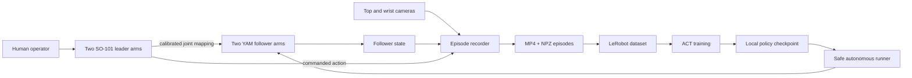

# YAM Dual-Arm Controller

## Project overview

YAM Dual-Arm Controller is an end-to-end system for operating and training a
bimanual robot. It maps two low-cost SO-101 leader arms onto two i2rt YAM
follower arms, displays three Intel RealSense camera feeds, records synchronized
demonstrations, converts those demonstrations into the LeRobot dataset format,
and runs locally trained Action Chunking with Transformers (ACT) policies on the
physical robot.

The project was built to close the gap between manually bringing up a robot and
collecting data that can be used for imitation learning. Instead of treating
teleoperation, calibration, recording, dataset conversion, training, and
deployment as separate experiments, the repository connects them into one
repeatable workflow with explicit hardware validation and conservative runtime
safety behavior.

At a high level, the system turns human motion into robot demonstrations and
then turns those demonstrations into an autonomous policy:



## The problem

Bimanual robot learning requires more than a teleoperation loop. A useful
system also needs to answer several practical questions:

- How does each leader joint map to the corresponding follower joint?
- How are differences in mechanical range and direction calibrated?
- How can two arms and multiple cameras be sampled into one consistent
  demonstration?
- How is that demonstration represented so an existing learning framework can
  train on it?
- How can a learned policy be evaluated without immediately giving it control
  of expensive hardware?
- What should happen when a servo read is corrupt, a camera is missing, or a
  process is interrupted?

These details are easy to overlook in a one-off demo, but they determine whether
the system is repeatable, debuggable, and safe enough to use for continued
experimentation.

## Project goals

The controller was designed around five goals:

1. **Natural bimanual control.** Allow an operator to control two seven-value
   YAM command vectors—six arm joints and one gripper value per arm—from two
   SO-101 leaders.
2. **Reproducible hardware setup.** Identify leaders by stable USB identity,
   calibrate their ranges, and validate every joint mapping before operation.
3. **Synchronized data collection.** Record three camera views, measured
   follower state, commanded action, and timestamps in a compact episode
   format.
4. **Compatibility with an established learning stack.** Convert episodes into
   a LeRobot dataset and train ACT without defining a custom training system.
5. **Conservative deployment.** Make inference hardware-free by default,
   validate every action, limit command velocity, and return the arms to a safe
   state when execution ends.

## System architecture

### 1. Leader-to-follower bridge

Each SO-101 leader communicates through a Feetech servo controller over USB.
The YAM follower arms communicate over separate CAN interfaces, conventionally
`can0` and `can1`. Leader devices are keyed by their stable
`/dev/serial/by-id` identity rather than a transient `/dev/ttyACM*` number, so a
controller retains the correct calibration after devices are unplugged or
reordered.

The bridge converts a raw leader servo tick into a follower target in three
steps:

1. Clamp and normalize the tick within the measured leader range.
2. Reverse the normalized value when the configured sign is negative.
3. Scale the value into the corresponding YAM joint range.

For leader value \(x\), calibrated leader bounds \([l, h]\), direction
\(s\), and follower bounds \([y_l, y_h]\), the mapping is:

\[
n = \operatorname{clip}\left(\frac{x-l}{h-l}, 0, 1\right),
\qquad
n' = \begin{cases}n & s=1\\1-n & s=-1\end{cases},
\qquad
q = y_l + n'(y_h-y_l)
\]

The configuration also supports fixed follower joints for degrees of freedom
that do not have a corresponding leader servo. The loader rejects incomplete,
duplicated, out-of-range, or ambiguous mappings before a robot is commanded.

### 2. Calibration and hardware validation

The calibration tool can discover and process multiple leaders concurrently.
Before recording any range, it repeatedly pings every configured servo and
checks that initial readings are stable. The operator then sweeps each joint
through its mechanical travel while the tool records minimum and maximum ticks.

Calibration is transactional: results remain in memory until every selected
controller passes. The tool writes a temporary configuration, validates it
through the same loader used at runtime, and then atomically replaces the old
file. A failed calibration therefore cannot leave the system with one partially
updated arm.

The configuration validator enforces several invariants:

- servo IDs are unique and positive;
- leader ranges are ascending and non-zero;
- mapping signs are exactly `-1` or `1`;
- no two servos drive the same YAM joint;
- fixed and mapped joints do not overlap;
- fixed positions fall inside the follower range; and
- every follower joint is either mapped or fixed.

### 3. Teleoperation

The teleoperation process creates a one-to-one pairing between leader ports and
YAM CAN channels. At approximately 100 Hz, it reads a leader, computes its
seven-value target, sends that target to the paired follower, and reads back the
measured follower position.

State and action snapshots are published through atomic files in `/dev/shm`.
This small interface decouples the hardware loop from the recorder and the ACT
dry-run process: those consumers can observe the robot without sharing device
handles or adding work to the time-sensitive command path. Failure to publish a
snapshot does not interrupt teleoperation, while hardware read failures remain
fatal so that corrupt input cannot continue driving an arm.

### 4. Camera dashboard and control panel

The camera dashboard owns the RealSense devices and streams the top and two
wrist views through Rerun. A lightweight web control panel presents hardware
status and controls for camera startup, teleoperation, episode recording, and
ACT inference.

Keeping camera ownership in one process avoids collisions between viewers,
recorders, and inference. It also allows the dashboard to publish compressed
camera snapshots for the autonomous runner without requiring that process to
open the cameras again.

### 5. Demonstration recording

The recorder samples the latest camera frames and shared-memory robot snapshots
at 15 Hz. Each saved episode contains:

```text
episodes/<dataset>/episode_XXXX/
├── top.mp4
├── wrist_1.mp4
├── wrist_2.mp4
├── data.npz
└── meta.json
```

`data.npz` stores three aligned arrays:

- `state`: measured follower positions with shape `(N, 14)`;
- `action`: commanded leader targets with shape `(N, 14)`; and
- `t`: wall-clock timestamps with shape `(N,)`.

The 14-value convention is `can0` followed by `can1`, with six arm joints and
one gripper value for each arm. Episodes are first written into a temporary
directory and only renamed into place when saved, so discarding a take—or
losing the process during a take—does not create a completed-looking partial
episode.

### 6. Dataset conversion and ACT training

The conversion tool decodes the episode videos and produces a LeRobot dataset
with three image features, a 14-value observation state, and a 14-value action.
The feature names preserve the arm and joint ordering used during recording,
which makes the data contract explicit at training and inference time.

ACT is a good fit for this workflow because it learns short chunks of actions
from demonstration data rather than predicting only a single low-level command
at a time. Training is delegated to LeRobot, while this project provides the
robot-specific data capture, schema, and deployment adapter. Checkpoints can be
kept locally or associated with a Hugging Face dataset for provenance and
sharing.

### 7. Autonomous execution

The autonomous runner recreates the observation layout used during training:
the two-arm state vector and the top, wrist 1, and wrist 2 RGB images. It loads a
local or Hub ACT checkpoint and runs at a configurable rate, normally 15 Hz.

Dry-run mode is the default. It reads camera and follower snapshots, prints and
publishes predictions, and never opens the YAM hardware. This makes it possible
to catch missing inputs, checkpoint schema mismatches, non-finite predictions,
and implausible actions before granting the model control.

Live execution adds several safeguards:

- predicted actions must contain exactly 14 finite values;
- the first predicted action is approached with a slow, velocity-limited ramp;
- subsequent commands are clipped by a configurable per-value speed limit;
- the original two-arm pose is saved as a home pose;
- on shutdown, the runner attempts a timed return home; and
- both arms enter gravity-compensation idle before their connections close.

These controls do not make an untested policy inherently safe, but they reduce
the risk of discontinuous commands and make dry-run validation the path of least
resistance.

## End-to-end workflow

The intended operating sequence is:

1. Install the project and its Python dependencies with `uv`.
2. Discover both leader controllers, CAN interfaces, and RealSense cameras.
3. Health-check and calibrate each leader.
4. Validate the mapping with one leader/follower pair at a time.
5. Start bimanual teleoperation and the camera dashboard.
6. Record task demonstrations into named episode collections.
7. Convert a small sample to LeRobot first, then convert the full collection.
8. Train an ACT checkpoint and preserve its dataset provenance.
9. Run the checkpoint in dry-run mode against live observations.
10. Only after inspecting predictions, enable live execution with an emergency
    stop in reach.

The repository also includes an agent skill that guides hardware discovery,
calibration, mapping validation, and the first safe teleoperation session. The
skill is intentionally not allowed to start motion on its own.

## Engineering decisions

Several implementation choices were made specifically for a physical robotics
workflow:

**Fail closed on hardware data.** A missing servo response or corrupt tick
raises an error instead of being ignored. Continuing with a stale or malformed
leader reading could turn a communication fault into unexpected motion.

**Separate real-time control from observability.** Teleoperation writes compact
snapshots to shared memory. Recording and inference consume those snapshots
without taking ownership of the arm interfaces.

**Use stable physical identity.** Calibrations are keyed to persistent USB
aliases, not enumeration order.

**Make writes atomic.** Both calibration updates and episode publication use a
temporary artifact followed by an atomic replacement or rename.

**Keep raw capture lightweight.** The recorder writes standard video and NumPy
files and does not need the full PyTorch/LeRobot stack on its critical path.

**Default to observation-only inference.** Autonomous execution requires the
explicit `--execute` flag; loading a policy alone does not open the arms.

## Technology stack

| Area | Technology |
|---|---|
| Robot hardware | i2rt YAM arms, DM motors, CAN bus |
| Leader hardware | SO-101 arms, Feetech STS3215 servos, USB serial |
| Vision | Intel RealSense, `pyrealsense2`, OpenCV |
| Visualization | Rerun web dashboard |
| Data | NumPy NPZ, MP4, LeRobot datasets |
| Learning | LeRobot, PyTorch-based ACT, Hugging Face Hub tooling |
| Application | Python 3.12, standard-library HTTP control panel |
| Environment | `uv` and `pyproject.toml` |
| Quality | Pytest unit tests, runtime configuration validation |
| Documentation | Jekyll/GitHub Pages and an agent-guided setup skill |

## Testing and validation

The repository includes tests for bridge mapping and validation, calibration
behavior, parity with the original implementation, teleoperation argument and
snapshot behavior, the autonomous policy contract and safety ramps, and the
project initializer.

Hardware-independent tests use fakes and stubs for serial buses, robot arms,
policy outputs, and filesystem state. Physical validation is deliberately a
separate layer: leader ping tests, stable-position checks, one-pair mapping
verification, camera snapshots, ACT dry runs, and finally supervised live
rollouts.

At the time of this writeup, the test suite could not be collected in the
current checkout because the local environment does not have the `i2rt` and
`lerobot` packages installed. This is an environment limitation rather than a
reported passing result, so no automated pass count is claimed here.

## Current status and limitations

The project implements the complete path from leader calibration through local
ACT inference, but several boundaries remain important:

- The recording stack still lives under `leader_yam_bridge/_v1` and uses parts
  of the original standalone pipeline. The modern teleoperation process now
  publishes the shared snapshots it needs, but the camera/recording code has not
  yet been fully migrated into the main package.
- Camera role assignment is tied to known RealSense serial numbers; an unknown
  camera receives a generic name and must be configured before it matches the
  three-view ACT schema.
- The recorder substitutes zeros when a teleoperation state sample is missing
  or older than 0.5 seconds. This keeps capture running but can silently degrade
  a dataset if status is not checked before recording.
- Synchronization uses latest-frame sampling and wall-clock timestamps rather
  than hardware timestamps or a formal multi-sensor synchronization layer.
- The speed limiter constrains command changes, but the system does not yet
  implement collision checking, workspace constraints, torque limits, or
  semantic task-level safety rules.
- Successful training loss is not treated as proof of task success. Real-world
  performance still requires repeated, supervised rollouts under the same
  camera placement and state ordering used for data collection.

## Future work

The highest-value next steps are:

1. Migrate the `_v1` recorder, camera dashboard, and control panel into the main
   package so calibration, teleoperation, and recording share one configuration
   and one set of interfaces.
2. Reject or visibly flag stale arm state during recording instead of silently
   writing zeros.
3. Add dataset validation that checks state/action dimensions, finite values,
   camera completeness, frame counts, timing jitter, and episode duration
   before conversion.
4. Move camera roles into configuration and add an interactive role-assignment
   step for new hardware.
5. Add rollout logging and evaluation metrics such as task success rate,
   completion time, intervention count, and policy-to-command clipping rate.
6. Add workspace and self-collision constraints before broader autonomous
   experimentation.
7. Run automated tests in a reproducible CI environment with hardware packages
   mocked or installed separately from hardware-in-the-loop checks.

## Outcome

YAM Dual-Arm Controller demonstrates a complete robotics learning loop rather
than a single control script. It combines robust leader calibration, bimanual
teleoperation, multi-camera observation, atomic demonstration recording,
LeRobot-compatible dataset generation, ACT training, and guarded deployment in
one repository.

The project's main contribution is the integration layer: it defines and
enforces the contracts between inexpensive leader hardware, YAM follower arms,
camera observations, demonstration data, and a learned bimanual policy. That
integration makes the system easier to reproduce, diagnose, and extend—and
creates a practical foundation for collecting better data and evaluating more
capable manipulation policies.

